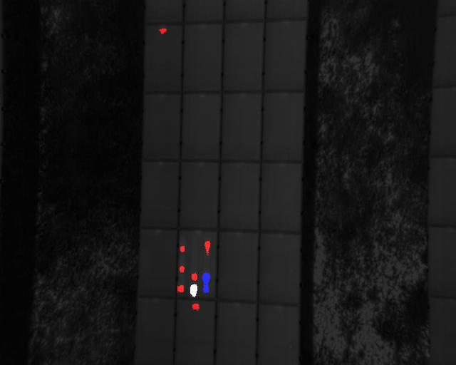

# Solar Panel Fault Detection using Thermal Image Analysis

This repository contains code and scripts for detecting and analyzing faults in solar panels using thermal image processing. The project focuses on identifying hotspots and anomalies to improve solar panel efficiency and maintenance.

## Features
- **Hotspot Detection:** Accurate identification of fault-prone areas using bounding box extraction and statistical analysis.
- **Mask Generation:** Extraction and overlay of masks for precise segmentation.
- **Feature Analysis:** Extraction of relevant features from hotspots.
- **Clustering:** Efficient grouping of similar fault categories.

## Directory Structure
```
root/
├── readingthermal.ipynb         # Main Jupyter Notebook containing the entire workflow
├── thermalstats.py              # Script for hotspot detection and statistical analysis
├── masks.py                     # Script for generating image masks
├── featureextraction.py         # Script for extracting features from hotspots
├── clustering_main.py           # Script for clustering fault types
└── README.md                    # Project documentation
```

## Execution Guide
### Option 1: Running the Complete Workflow
1. Open the `readingthermal.ipynb` file in Jupyter Notebook or Google Colab.
2. Run the cells step by step to execute the entire workflow, from image preprocessing to model evaluation.

### Option 2: Running Individual Scripts
1. **Hotspot Detection:**
   ```bash
   python thermalstats.py
   ```
2. **Mask Generation:**
   ```bash
   python masks.py
   ```
3. **Feature Extraction:**
   ```bash
   python featureextraction.py
   ```
4. **Clustering:**
   ```bash
   python clustering_main.py
   ```

## Results
Upon execution, the project delivers the following outputs:
- **Hotspot Detection Visualization:** Visual overlays marking detected faults.
- **Feature Extraction Outputs:** Tabular feature data for fault classification.
- **Clustering Visualizations:** Graphical plots representing clustered fault types.

Raw Image:
- **Thermal image:**
  

Sample Output:
- **Hotspot Detection Visualization:**
  

- **Clustering Example:**
  
